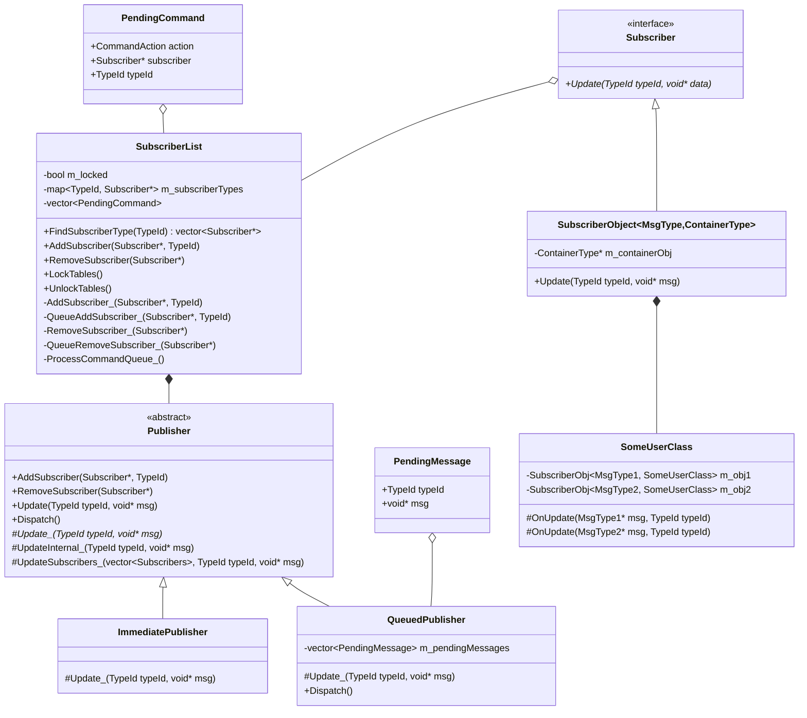
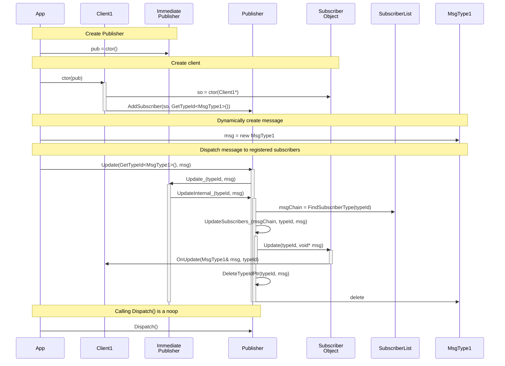
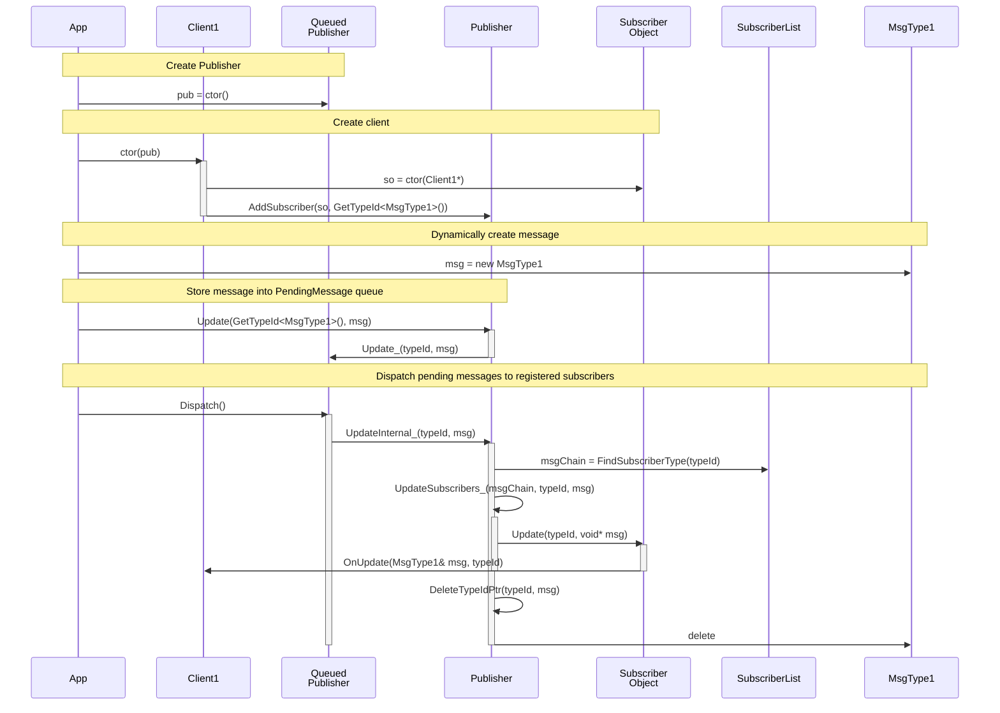

# Introduction

This is a C++ implementation of a Publish-Subscribe Pattern with a twist -
the message passed between components can be any type. The trick is to use a
hash of the message structure name and store all messages as void pointers
(`void*`).

See [Design Section](#Design) below.


# Tests

I wrote a multi-threaded application to test the `QueuedPublisher` class to
ensure that while dispatching messages in one thread, other threads aren't
blocked from adding new pending messages.

I also added a GTest (Google Test) to verify that the QueuedPublisher class
frees messages after they are dispatched.


# Configuration

I'm building on Ubuntu 24.04 but this code will compile on Linux, Windows, and
MacOS. The configuration step here should be the only step that needs to be
customized for your specific environment.

## Ubuntu

I've put the configuration into the `setup.sh` script but I'm showing the steps
explicitly here:

I needed to install Google Mock and GTest. This only needs to be run once:

```bash
sudo apt install -y google-mock libgmock-dev libgtest-dev
```

These steps need to be run to setup the `build` directory which caches your
choices of compiler and release type.

Here, I'm configuring a **Release** build using **Ninja** in the `build`
directory.

```bash
rm -rf build/
mkdir build && cd build
cmake -GNinja \
    -DCMAKE_BUILD_TYPE=Release \
    -DCMAKE_INSTALL_PREFIX=bin \
    ..
```

## Windows

**TODO**: Document steps to build using VisualCode.

**TODO**: Document steps to build using VisualStudio.

## MacOS

**TODO**: Document steps to build on MacOS using ???.


# Building

When using GNU Make or Ninja, and you want to have a `debug` build and a
`release` build, you will need two directories. You choose the directory using
the `--build <directory name>` option.

When using Microsoft Visual Studio, you can use one directory and specify the
build type using the `???` option.

Run this from the top directory (i.e. build/ directory should be present).

Once configured, these commands should work on any platform.

```bash
# Run this from the top directory (i.e. build/ directory should be present).
cmake --build build
```

If you want to build a specific target, use the `--target` option:

```bash
# Here I'm building the PubSub library (i.e. libPubSub.a on Linux).
cmake --build build --target PubSub
```


# Testing

After building, you can use this `cmake` command to run the CTest and GTest
test cases.

```bash
cmake --build build --target test
```


# Design

The main purpose of this code is to show how to hash a structure's name. The
rest of the code is a Proof of Concept (PoC).

Passing around `void*` is easy. The hard part is being able to delete the
message when it is no longer needed.

C++ templates and C Preprocessor (CPP) macros are used to create template
specialization instances of the `GetTypeId<MessageType>()` function and
register a deleter for the `MessageType`. The `GetTypeId<>()` functions are
used in the code to retrieve the hash value needed to publish messages to all
listening subscribers.

# UML Class Diagram



## Subscriber

This interface class defines the callback function needed to be implemented
by subscribers.

## SubscriberList

This class manages the TypeId to Subscribers lists on behalf of the Publisher
class.

During message dispatching, the callback functions may want to subscribe or
unsubscribe from the Publisher but these requests must be delayed until after
dispatching has completed.

## Publisher

This abstract class allows other components to register themselves as
Subscribers to be able to receive one or more different type of messages.

If running in a multi-threaded application, the Subscriber's `Update()` method
must guard against potential contention issues if accessed from multiple
threads simultaneously.

Here are two concrete implementations of the Publisher class. I'm sure there
are other implementations that I haven't thought of.

### ImmediatePublisher

This concrete class is used to dispatch messages immediately by using the
calling functions thread.

When using this publisher, it is possible to overflow the stack if the
Subscriber's `Update()` method also publishes a message.

### QueuedPublisher

This concrete class is used to queue messages for later delivery. The delivery
happens when the `Dispatch()` method is called.

## SubscriberObject

This template class is used to bind a Subscriber to a user defined class for
specific messages.

This class implements the Bridge Pattern so the type casting and dispatching
code is isolated from other user code.

The logic in this class could be implemented directly in the user class which
would eliminate the need for `SubscriberObject` member variables.

The user defined class must implement an `OnNotify(MsgType&, TypeId)` callback
function. I changed the name to make errors in usage more obvious during
compilation. The `OnNotify()` method is overloaded for each message type.

# Sequence Diagrams

Here are two sequence diagrams showing the difference between the two
Publishers. The code is almost identical as all common code is stored in the
`Publisher` class.

## `ImmediatePublisher` Sequence Diagram

This sequence diagram shows how a message is published using an immediate
publisher to all registered subscribers (only one in this example). There
could be zero, one, or many subscribers.

In a multi-threaded application, using an Immediate Publisher would result in
every thread calling `Publisher::Notify()` which may result in contention
issues.



## `QueuedPublisher` Sequence Diagram

This sequence diagram shows how a message is published using a queued
publisher to all registered subscribers (only one in this example). There
could be zero, one, or many subscribers.

In a multi-threaded application, using a Queued Publisher would allow the
callback functions to queue up work that needs to happen periodically. A
controlling thread could use a timer to dispatch messages at regular intervals.

An example would be a game engine that dispatches messages every frame.



