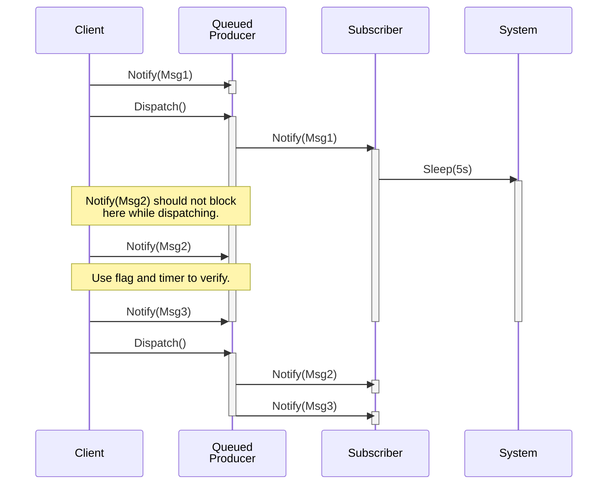

# Test

These are simple tests written using CTest (CMake tests) and GTest (Google Test).

These tests can be improved. One change is to remove timers and replace them
with other primatives like condition variables or semaphores.

## TestPublisher.cpp - MsgFreedAfterPublish

Simple test using QTest to verify message allocated on the stack is freed
after calling QueuedPublisher::Dispatch().

## ImmedPubTwoSubsOneMsg

## QDTwoSubs

## ImmedPubOneSubTwoMsgs

## QPubOneSubTwoMsgs

## TestQPubSubObjTwoMsgs

## TestQPubThreadedNoBlocking

This CTest uses multi-threading to verify that while
`QueuedPublisher::Dispatch()` is executing, other threads are able to call
`QueuedPublisher::Notify()` without blocking.

